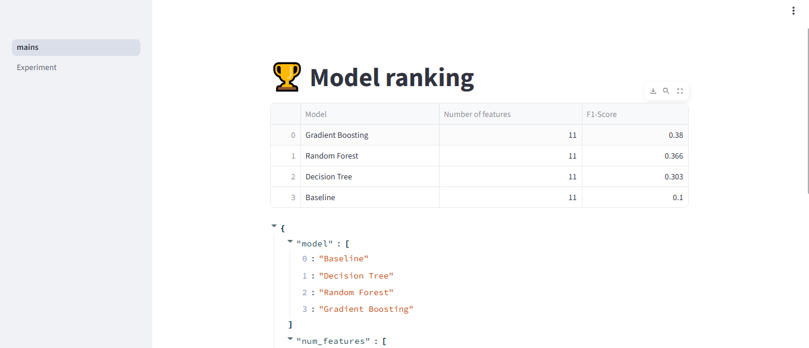

#  ML Model Comparison App

An interactive Streamlit app to **train, compare, and evaluate ML models** on the Wine Quality dataset.  
The app lets you run multiple models, view their performance metrics, and analyze confusion matrices — all in one place.

**Live Demo (Render Deployment):** [Click Here](https://wq-13.onrender.com)  
**GitHub Repo:** [ml-model-comparison](https://github.com/manu10kale-creator/ml-model-comparison)

---

##  Features

- Train multiple models: **Baseline, Decision Tree, Random Forest, Gradient Boosting**  
- **Hyperparameter tuning** with GridSearchCV  
- **Model ranking dashboard** based on macro F1-score  
- Interactive **confusion matrix visualizations**  
- Persistent results stored using **Streamlit session state**  
- Deployed on **Render**

---

##  Tech Stack

- **Python**  
- **pandas**, **NumPy**, **scikit-learn**  
- **Matplotlib** for visualizations  
- **Streamlit** for interactive dashboard  
- **Render** for deployment

---

##  Example Screenshots

**Model Ranking Page**  
  

**Confusion Matrix Example**  
  

**Results Table**  

